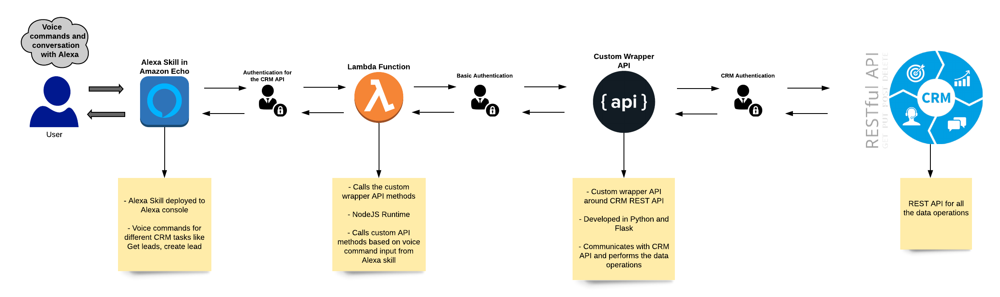
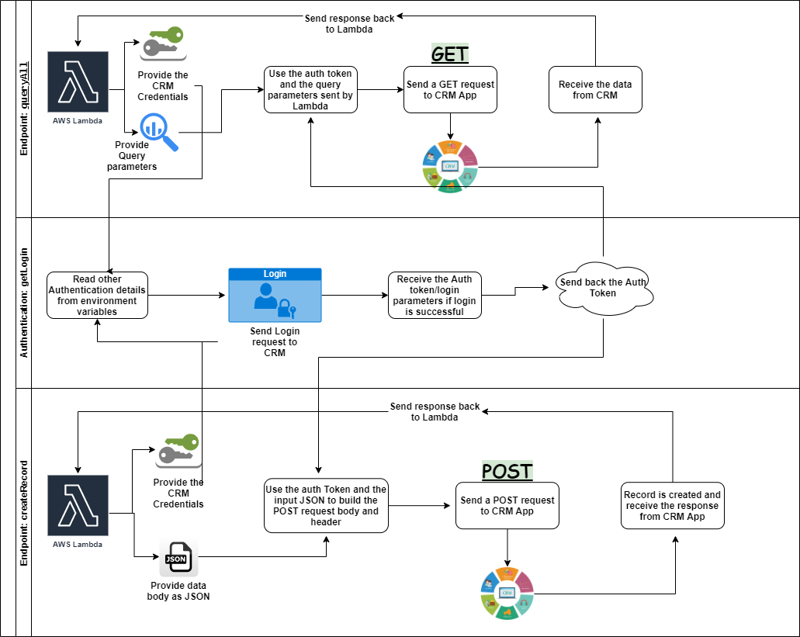
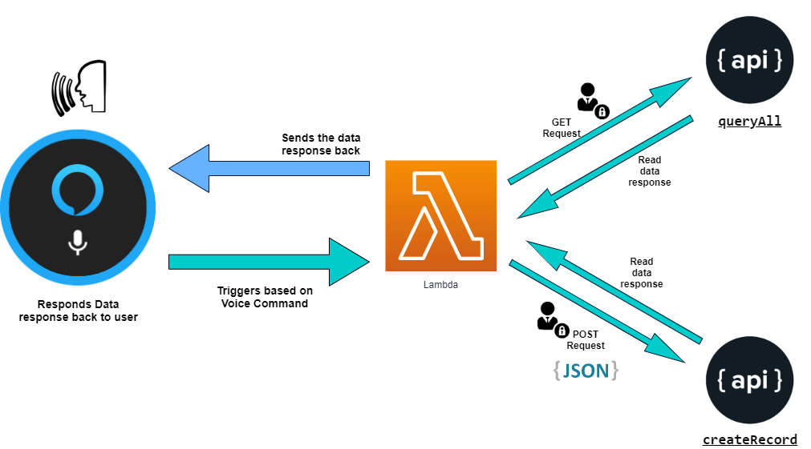
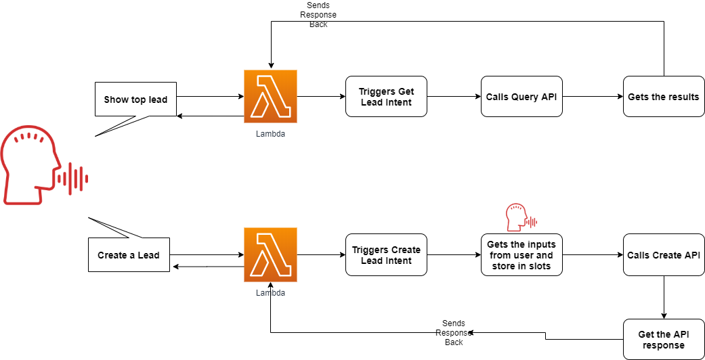
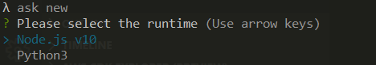
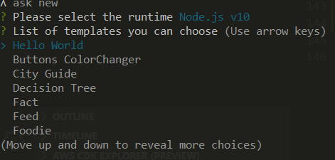
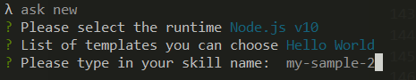
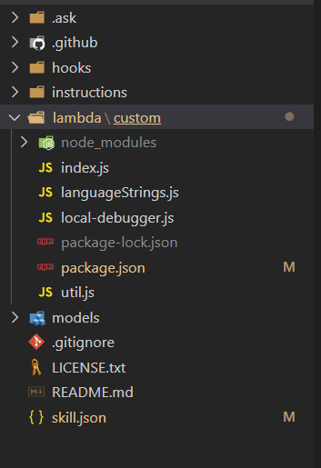

# Integrate a CRM Application with Alexa using AWS Lambda-Part-2  

This post is in continuation to the earlier post where I described the basic Architecture and flow of the Alexa-CRM integration.If you havent read the earlier one, here is the link:  

https://medium.com/@amlana21/integrate-a-crm-application-with-alexa-using-aws-lambda-part-1-17864343eb03?sk=9ad4aeb3ce7b97238859c47c0cb9c9b4  

Now we know about how the overall solution works and how each component interact with each other. Next I will go thorugh high level steps to setup each of the component/service separately and some details about each of them.

As usual, you can find the whole code repo here:  

https://github.com/amlana21/alexa-crm-integration-post  

## Pre-Requisites  
To setup the custom wrapper API and the end to end integration, there are few pre-requisites which you will need. These need to be kept ready before starting the activity to setup the integration solution.  

- AWS Account  
- Install and configure AWS CLI on local machine
- Install Docker on the instance where the API will be hosted  
- Setup ASK(Alex Skill Kit) CLI on local machine  
- Python installed on local machine  
- SFDC Development account  
- An Alexa Dev console account

## Lets Revise  
Before we start with the next step, lets go through the flow on a high level to refresh our memory. Below is the end to end architectureof the solution which we will be setting up.  

  

For the setup I will be using an example of SFDC as the CRM application.Since we already have a readymade SFDC developer sandbox, we will start the setup from the custom API. The wrapper API performs all the data functions directly with the CRM application through the REST API exposed by the CRM application. When the skill is invoked on Amazon Echo, it triggers the Lambda function. The Lambda function, based on the vice command input, calls the respective endpoint from the wrapper API. The wrapper API endpoint calls respective CRM API endpoint to work on the CRM data. The output data is returned to the Lambda function which the outputs the data through the ALexa voice interface.  

The wrapper API contains different functions to call different API endpoints from the CRM application. We will be going through those in detail here.  

## About the Wrapper API  

The custom wrapper API is a REST API built with Flask and Python. It exposes different endpoints for GET and POST requests. Because it will be performing transactions with the CRM API, the authentication details are stored as environment variables. Below is a high level flow of the code and its components.  

  

Let me explain what are the different components in the wrapper API code and what each function do. Below are the files included in the wrapper API:  
- <em>application.py: </em>This is the entrypoint for the Flask application. There are two routes defined for the API which serve as the two API endpoints. One of the endpoint is to Query the records from CRM and other one is to create the records. I will explain the endpoint details below. The environment variables are read in this main file and then passed on to different endpoints accordingly. 
- <em>apifunctions.py: </em>This is the class file which defines a class for all the API functions. API GET and POST methods are defined as two Class methods. The methods return the data response returned from the CRM application. Below are the functions performing the GET and POST requests to CRM API:  

  - getLogin: This is the function to perform the authentication and get the auth details like Auth token, successful session token etc. In this example it is sending a POST request to SFDC to retireve the session token to be used in further GET and POST requests. Required authentication parameters which are stored as environment variables, are passes to this function along with the credentials which are sent as Auth headers to the Flask API endpoint. This function gets called first everytime any of the custom API endpoints are invoked.  

  - queryAll: This function performs the query operations. This is called by the Query records endpoint. When this is function is called, it first gets the auth details and the query parameters sent to the custom API endpoint. Then it sends the GET request to CRM application. Once data response is received, it sends the response back as JSON response.  

  - createRecord: This function is called when the create record API endpoint is invoked. When this is called, as first step it gets the auth details from the class properties and the body data from the input sent to the API endpoint. With these details it sends the POST request to CRM application. Once successfu it gets the response from the CRM application and sends the JSON response bac to caller of the API(in this case Lambda)  

### Endpoints  
The wrapper API provides below two endpoints based on whether you are querying data or creating record:  
 1. <em>getall: </em>This is endpoint is to query the records. To get data, a GET request is sent to this endpoint. Along with the GET request credentials are sent as Basic Authentication headers with the request. Also the query parameters if any are sent as '?q=<query_parameters>'. It responds with the data in JSON format  
 2. <em>createRecord: </em>This is the endpoint to create record in CRM. A POST request has to be sent to this endpoint. The credentials are sent as Basic Authentication headers with the request. The data is sent as JSON as body of the request. The needed fields and corresponding data has to be sent as the body. Along with the the data if there are any url parameters needed by the CRM App, they are also sent in the body. Here is an example for the body for a request to SFDC:  
 ``` 
 {
	"data":{
		"FirstName" : "My New",
		"LastName" : "Last",
		"Company" : "Test Comp"
	},
	"urlparams":"services/data/v48.0/sobjects"
}
```
### Authentication  

I havent used/setup a any separate authentication module in the wrapper API. I am using the same authentication provided by the CRM application. The endpoints in the wrapper API use the same credentials as the CRM application and process internally to establish a session with the CRM App. This way the authentication flow is invisible for the end user and for them it is like they are just logging in to CRM with their credentials.  

### Environment Variables  
For the current scenario, the environment details I defined are related to the authentication details required by the SFDC CRM Application. For any other other CRM application, other details can be defined in the environment variables and used in the scripts.

## Lambda Function Details  

Lets switch gears and move our focus to the Lambda function which will be calling the wrapper API and provide responses to Alexa. Below is a high level flow of high the Lambda function will perform the tasks.  

 

Currently the Lambda function only supports one query and creation of a record in SFDC. The lambda function consists of different intents for each task and they get triggered based on the voice command to Alexa. Lets go through them briefly. Below are the commands which trigger the respective intents and functions from the Lambda:  

- <em>Alexa ask my assistant for my top lead: </em>Once this voice command is sent, it triggers an intent in Lambda. The intent triggers a function to call the Query data endpoint from the wrapper API. The data returne from the CPI is parsed by the function and sent back to Alexa in a conversation format.  
- <em>Alexa ask my assistant to create a lead: </em>With this voice command, it starts a series of questions to gather the needed Lead creation data from the user. Once all data is gathered, the Lambda function sends a POST request to the wrapper API with the JSON body containing the lead creation data. Once the record is created in CRM, the function reads back the response and sends a confirmation to Alexa so a confirmation is spoken back to user.  

On a high level this is the functionality achieved by the Lambda function. The lambda function is part of the Alexa skill code which gets deployed to the Alexa console to train the skill model. I wouldnt go in detail about how to build a skill for Alexa but you should be able to find details about that here: https://developer.amazon.com/en-US/docs/alexa/custom-skills/steps-to-build-a-custom-skill.html  

The Lambda function end to end functionality can be described in below diagram:  

 


## Deployment  

That should be a good explanation of the solution is working in the backend. Now its time for us to deploy the different components so the solution can work. I will not go into much detail on how to deploy and enable the ALexa skill as that will be a separate topic itself. I will go through some high level steps and you can go into the above AWS documentation to get into more details.  

### Deploy the Wrapper API  

I will be deploying the wrapper API as a Docker container running on an EC2 container. To follow along you will need an AWS account and an EC2 instance running. If you want to easily spin up a network and an EC2 instance, you can use the cloudformation template I have included in the repo. Assuming you have already configured AWS CLI on your machine, run the below command to create a deploy the Cloudformation template creating the stack and spinning up the EC2 instance.  

```
aws cloudformation create-stack --stack-name myapistack --template-body file://deploy_ec2_network_v1.json --parameters ParameterKey=KeyP,ParameterValue=<replace with key pair name> ParameterKey=InstanceType,ParameterValue=t2.micro  

```
Once the instance status changes to available, you can SSH into the instance and start next steps. As next step, make sure you install Docker and Docker compose on the instance. If you want to easily launch and configure an instance, you can go through my other post where I explain this:  
https://medium.com/@amlana21/a-jenkins-pipeline-to-launch-personal-ec2-instances-on-aws-and-bootstrap-using-chef-332591ac51a5?sk=9b640eb1864741bef9946aeadf6886d8  

Here I have used docker compose to start the Docker container as I dont have a multi node setup. But in actual Production setups there will be multiple nodes involved and we will be using Docker stack deploy to deploy the API as service across those nodes.  
So for this lets deploy using docker compose. Once Docker and compose are installed, run the below commands to download the scripts and get in the folder:  

```
git clone https://github.com/amlana21/alexa-crm-integration-post  
cd alexa-crm-integration-post/wrapper-api  
```

This brings us to the folder containing the wrapper API files. At this point according to your CRM application, set the below environment values in the docker-compose.yml file. The example her is for SFDC scenario.  

```
environment: 
      - HOSTURL= ''
      - GRANTTYPE= 'password'
      - CLIENTID= ''
      - CLIENTSECRET= ''
      - ENV= 'PROD'  
```
Once done, the save the file to come back to the prompt. Run the below command to start the Docker container(service):  

```
docker-compose up -d  
```  
This will start the service in backend. To check the status of the container run:  
```
docker container ls -a  
```  
If you see the container status is up then the API deployment was successful. The API will be available at: http://<ec2_instance_domain>:5000.  

### Deploy the Alexa skill and Lambda Function 

I will not go into much detail on how to deploy the Alexa skill. Here are the high level steps which are need to create a new skill and add the needed lambda function. Then the Lambda function need to changed to include the functionality and Intents I described above. Make sure to use the above API endpoint in the Lambda function. It will be better to define the API URL as environment variable on the Lambda function:  

1. Install and configure Alexa skill kits on your local machine  
2. Create a new Alexa skill:  
```
ask new  
```  
3. Select the runtime which you are comfortable with:  

 

4. Select a template to start with. For simplicity start with the Hello World Template:  
  

5. Type in the name for your skill   
 

6. The skill will be created in few minutes. This will contain a Lambda function and other supporting files for the skill. You can go ahead and modify the files to shape up the skill as you want. The basic functionality I have explained above.  
 

7. Once you are done with the code, run the below command to deploy the skill to the Alexa console where you can test the skill on an actual Amazon Echo connected to the Dev account.  
```
ask deploy  
```  

This completes our deployment of all the components. Now we can test the skill by invoking the commands either through an Amazon Echo or through the Alexa Dev Console. If there are any issues, we can check the Cloudwatch Log stream for the specific Lambda and check for any issues inside the function. Make sure to console log/print outputs as necessary for debugging.  

## Conclusion

Hope I was able to explain my solution of integrating a CRM App to Alexa. If you setup this whole solution on your own, this can be useful as a learning experience too to learn those different parts like developing an API in Python, developing an Alexa Skill, write a Lambda function etc. I would suggest to not just copy the code but understand the concept and then apply the parts. This example is an initial version of my Alexa-CRM skill. I am continuing to work on the script to add new features and complex CRM scenarios to be invoked on the skill. One thing I am still struggling or working on is mainly the Authentication better and giving the end user a seamless experience. I will keep my Github repo updated as and when I making new changes. So keep an eye on the repo for new changes. 

I also welcome suggestions or comments on my solution because that will help me improve this skill overall. Please feel free to raise issues on the Github repo providing issues/feedback/suggestions. As usual for any questions or issues please email me at amlanc@achakladar.com.