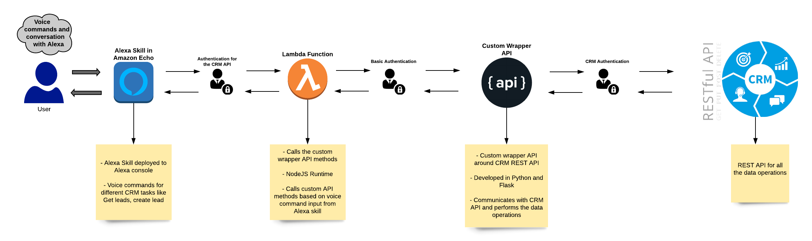

# Integrate a CRM Application with Alexa using AWS Lambda-Part-1  

I have been configuring and customizing CRM applications for my whole professional career. So from the day I learnt about AWS lambda and how it can be used with an Alexa skill, I have planning to Alexa-enable a CRM application.Last week I completed my side project and developed an Alexa skill to integrate Salesforce(SFDC) application with Alexa. I am still refining the functionality to make it more secure and user friendly but meanwhile I will be able to write some posts describing my integration solution.Though this example is based on SFDC, it can easily be extended to any other CRM applications too like Oracle Sales cloud, Microsoft Dynamics CRM etc. As long as there is a REST API interface for the CRM app, with a little change this solution can be re-used.  

This will be a series of multiple posts because there are multiple components involved and I can't fit them in one post. So bear with me as I go through, what I built and how I built it. To fully understand the flow there will be some basic understanding needed for the following technologies:  
- Basic AWS Lambda understanding  
- Basic knowledge about how Alexa works. Dont need a deep knowledge  
- Understand what is CRM  
- What is an API  

The code base is available on my Github Repo:  
https://github.com/amlana21/alexa-crm-integration-post

## What is CRM  
Lets get some basics out of the way.CRM(<b>C</b>ustomer <b>R</b>elationship <b>M</b>anagement) is a basic part of any business. To keep the business together, there has to be a proper system to manage the customers and relationships with them. A CRM application lets companies automate all of their Customer handling related processes like managing Customer lists, handle customer interactions, manage sales etc. There are multiple facets to a CRM application. To name a few Sales, Service, Marketing, Support and on and on. An application to manage the CRM processes for a company is nearly a mandatory thing now.  

There are many SAAS CRM application available in the market. To name a few top CRM applications: SFDC, Oracle Engagement Cloud, Microsoft Dynamics. In this post I have taken up an example of SFDC for the integration with Alexa.  

## What is Alexa  
I dont think Alexa needs a separate introduction. Amazon echo has become a part of day to day lives for many of us. Alexa is the virtual assistant built in the Amazon echo devices. It is a voce controlled assistant where you can communicate normally with the device to perform specific actions. It is mostly useful in home automation scenarios.  

Alexa skills are specific abilities which you enable on the device so that Alexa can understand and perform the specific action. The integration with the CRM application is also a skill which needs to be activated so that Alexa can understand the conversation and respond accordingly.  

## About the Functionality  
Let me explain what are the features which my solution supports through Alexa. At a high level below is the flow which is handled by the Alexa skill when it is triggered:  
- The skill is invoked by speaking the invocation name to Alexa(for now I have kept the invocation word as <em>my assistant</em>)  
- Ask the spcific command based on what you need from CRM  
- In the backend, the skill triggeres a Lambda function which calls the CRM API to perform the necessary task like get data, create records etc.  
- The skill gets the output from the Lambda function and responds the data to the user through voice reply  

Below are the complete back and forth conversations for the functionalities which are currently supported by my CRM Alexa skill.  

<b>Get a Top Lead to work on: </b>Returns with an open lead owned by the user and with oldest creation date.  

   

<b>Create a lead: </b>Create a lead after taking inputs from the user.User invokes the skill with the name.Alexa asks the user for some details about the lead to be created.Based on the inputs, the lead is created.  

  

Here the Lambda function is communicating with SFDC through REST API and performing the respective task like querying the lead and creating the lead in SFDC. Currently I have only completed these two conversation flows. I will be adding more complex conversation flows to get more interactive data from CRM.  

## Solution Architecture  
Below is a high level architecture of the whole end to end integration solution. I will go through each component briefly to provide you the basic understanding of how each of them contribute to the flow.  

 

Below are the components involved in the end to end flow of the request from user's voce command to the CRM application. This is a basic high level description. I will be going through each of them in detail in upcoming sections:  

- <em>Alexa Skill: </em>This is the skill which gets deployed through the Alexa Developer console. This is the starting point of the flow and handles the voice command to function execution translation.  
- <em>AWS Lambda Function: </em>This is a lambda function with a NodeJS runtime.The Alexa skill calls the Lambda function based on the different voice commands which user speaks to Alexa.Within the Lambda Function, there are different intents which get called based on what voice command user speaks to Alexa.For e.g if user asks to get the top lead, the Get query function from the Lambda function is called which calls the custom wrapper API to query the data from CRM.  
- <em>Custom Wrapper API: </em>This is a custom REST API built with Python and Flask. The API acts as a wrapper around the CRM REST API endpoints. It exposes various REST API endpoints to Query Data, Create records.The custom API endpoints when called, in the backend, call the CRM API endpoints to perform the data tasks. Technically Lambda can directly call the CRM API but I developed this cutom wrapper API and put it in between Lambda and the CRM.The idea is to have more control on what data from CRM is sent back to Lambda for the Alexa skill to consume.The wrapper AI code is built to work with any CRM API with some little changes. As long as the CRM has a REST API enabled, this cutom API can communicate with the CRM.  
- <em>REST API in CRM: </em>This is the REST API provided by the CRM application. The endpoints differ based on different CRM application. Here I have used SFDC as an example. Based on what objects and funcations we want to enable for the functionality, respective API endpoint need to be used from the CRM and called through the custom wrapper API.  
- <em>Authentication Methods: </em>There are authentication steps added at various stages.The custom wrapper API uses the same credentials from CRM application to authenticate. In the Lambda function, the same authentication details is passed to the wrapper API endpoints. I will go into more details in upcoming post.  


## Solution Flow  
Let me explain how a request flows from start to end for a typical conversation flow between the user and Alexa.This will help visualizing the working mechanism of the solution.  

 

To explain this with an example, lets see what the flow looks like when user asks Alexa  
```
Alexa... ask my assistant to get my top lead  
```  

1. Once user asks with the voice command, it invokes the specific skill in the backend  
2. The skill is associated with a Lambda function on the backend. The Lambda function gets triggered  
3. The Lambda function consist of a set of Intents which are tied to each of the separate voice commands. For this example, it triggers the intent to query the Lead  
4. The intent executes a function which calls the 'queryAll' endpoint from the wrapper API. It also passes the Query parameters for the specific data query and the Authentication details needed. For this example the query parameters passed will be th query to get the lead data from CRM  
5. In the wrapper API, the corresponding function gets executed which is called by the 'queryAll' endpoint.
6. The function sends a GET request to the CRM API and passes the query parameters received from the Lambda function. It also passes the Authentication details to establish the session with CRM API and receive the data response  
7. The wrapper API parses the response from the CRM app and sends it back to the Lambda Function. The Lambda function reads the response and converts the response to a Conversation response format which is specified in the Intent  
8. The Alexa skill gets the Coversational response from the Lambda function and speaks back the response to the user  

```
I found this lead which I think you should work on, Name is Testing C, test@email.com  
```


## More Extensions to the Functionality  

I am still working in adding some more functionality to the Integration solution.But the basic functionality I described here remains the same. Some of the changes I am still working on are:  
- Better Authentication mechanism  
- Provide more CRM functions as voice commands  
- Make the Custom Wrapper API more dynamic to support a plug and play type og behaviour with any CRM application  

## In Posts to come  

In upcoming posts, I will be going thorugh rest of the details for the solution and explain how you can set this up on your own. I will be describing some high level setup steps to sping this whole solution yourselves. But I wont be getting into details for some of the components as those are larger topics to handle. I will be covering these in upcoming posts:  
- Describe the Custom wrapper API details and how to deploy the API  
- Describe the Lambda function and the Alexa skill. Describe how to setup your own Alexa skill pointing to the Lambda function

## Conclusion  

Hope I was able to describe my Alexa-CRM integration solution and you understand how this works. CRM applications have become a mandatory thing for businesses now. Also Alexa has become a day to day use item for many people. So knowing a way to connect those two can be a great skill to learn. Many of you may be working on CRM applications and can try this setup to enable Alexa in your own projects.For any questions please reach out to me at amlanc@achakladar.com.